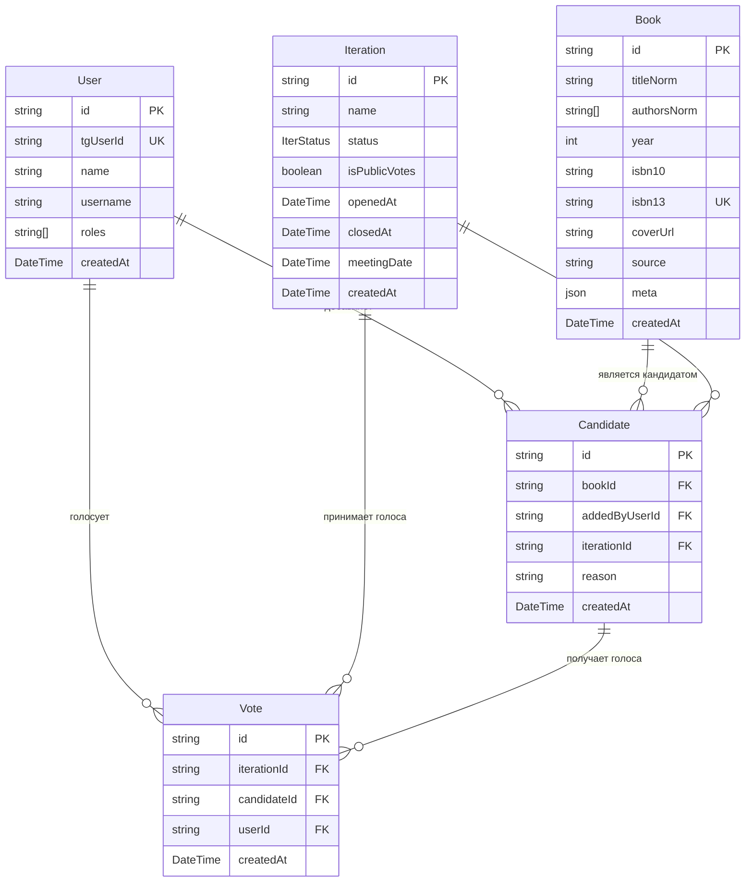
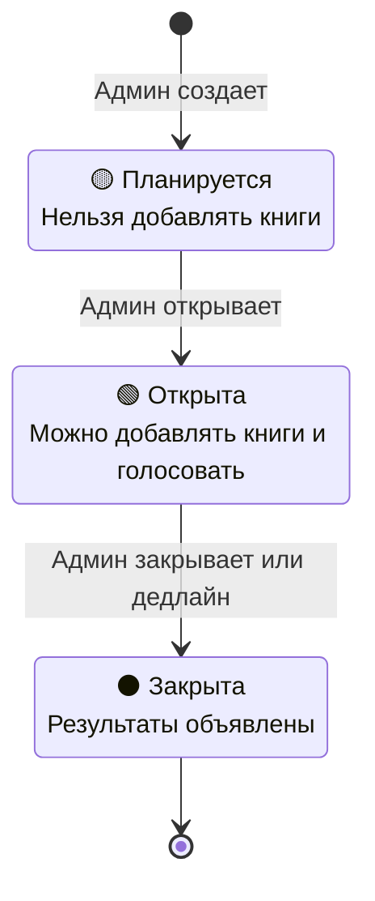

# BookClub TMA - Архитектура системы

## Обзор

BookClub TMA - это Telegram Mini App для управления книжным клубом с системой голосования за книги.

## Архитектура

### Технологический стек

**Backend:**
- **NestJS** - Node.js фреймворк
- **Prisma ORM** - Работа с базой данных
- **PostgreSQL** - Основная база данных
- **Redis** - Кеширование результатов поиска
- **JWT** - Аутентификация
- **Telegram Bot API** - Интеграция с Telegram

**Frontend:**
- **Next.js 14** (App Router) - React фреймворк
- **TypeScript** - Типизация
- **Telegram Mini App SDK** - Интеграция с Telegram
- **CSS-in-JS** - Стилизация

**Инфраструктура:**
- **Render** - Хостинг и деплой
- **GitHub** - Версионирование

## Структура данных

### Основные сущности



### Состояния итерации



## Бизнес-логика

### Основные процессы

1. **Создание итерации (Админ)**
   - Админ создает итерацию со статусом `PLANNED`
   - Устанавливает название и дедлайн
   - Открывает итерацию (статус → `OPEN`)

2. **Добавление книг (Пользователи)**
   - Поиск книг через Google Books API (с кешированием)
   - Добавление найденной книги как кандидата
   - Автоматическая дедупликация по ISBN13

3. **Голосование (Пользователи)**
   - Один голос на итерацию от пользователя
   - Возможность изменить свой выбор
   - Подсчет голосов в реальном времени

4. **Завершение итерации (Админ/Автоматически)**
   - Закрытие по дедлайну или вручную
   - Определение победителя по количеству голосов
   - Анонс результатов в Telegram канал

### Правила доступа

**Администраторы (`admin` роль):**
- Создание/открытие/закрытие итераций
- Установка дедлайнов
- Просмотр всех данных

**Пользователи:**
- Поиск и добавление книг
- Голосование за кандидатов
- Просмотр текущей итерации и истории

## API Design

### RESTful принципы

```
GET    /iterations/current      # Текущая открытая итерация
POST   /iterations             # Создание (admin)
PATCH  /iterations/:id/open    # Открытие (admin)
PATCH  /iterations/:id/close   # Закрытие (admin)

GET    /books/search?q=query   # Поиск книг
POST   /candidates             # Добавление книги
DELETE /candidates/:id         # Удаление своей книги

POST   /votes                  # Голосование
POST   /auth/telegram/init     # Аутентификация
```

### Аутентификация и авторизация

1. **Telegram Mini App Auth:**
   - Валидация `initData` от Telegram
   - Создание/обновление пользователя
   - Выдача JWT токена

2. **JWT Security:**
   - Payload: `{ uid, tg, r }` (user id, telegram id, roles)
   - Время жизни: 7 дней
   - Проверка на каждом защищенном эндпоинте

## Интеграции

### Google Books API
- Поиск книг по названию/автору
- Получение метаданных (обложки, ISBN, год)
- Кеширование в Redis на 24 часа

### Telegram Bot API
- Отправка анонсов результатов в канал
- Форматированные сообщения с обложками книг
- Inline кнопки для взаимодействия

### Redis Caching
- Кеш поиска книг: `gbooks:{base64(query)}`
- TTL: 24 часа
- Автоматическая очистка через API

## Деплоймент

### Render.com
- Автоматический деплой по коммиту в main
- Переменные окружения в Render Dashboard
- Автоматические миграции Prisma

### Database Migrations
- Управление через Prisma
- Применение при деплое: `prisma migrate deploy`
- Прямой доступ к PostgreSQL для критических изменений

## Мониторинг и логирование

### Структурированные логи
```typescript
console.log('[CONTROLLER][ACTION] details', data);
```

**Категории:**
- `[AUTH]` - Аутентификация
- `[BOOKS]` - Поиск книг  
- `[CANDIDATE]` - Добавление/удаление книг
- `[VOTE]` - Голосование
- `[ADMIN]` - Административные действия
- `[API]` - HTTP запросы

### Метрики
- HTTP статус коды и время ответа
- Количество поисковых запросов
- Активность пользователей
- Ошибки и исключения

## Безопасность

### Данные
- Валидация всех входящих данных
- SQL Injection защита (Prisma ORM)
- XSS защита (CSP headers)

### API
- Rate limiting через Render
- CORS настройки для Telegram
- JWT токены с коротким TTL

### Telegram
- Проверка подлинности initData
- Валидация Telegram подписи
- Проверка времени жизни данных (1 час)

## Производительность

### Кеширование
- Redis для поиска книг
- Browser cache для статических ресурсов
- CDN через Render

### Оптимизации
- Prisma query optimization
- Дедупликация поисковых результатов
- Lazy loading компонентов (Next.js)

### Масштабирование
- Stateless сервис (горизонтальное масштабирование)
- Separated concerns (контроллеры/сервисы)
- Database connection pooling

## Будущие улучшения

1. **Функциональность:**
   - Система рейтингов книг
   - Комментарии к предложениям
   - Напоминания о дедлайнах

2. **Техническое:**
   - GraphQL API
   - Real-time updates (WebSockets)
   - Mobile приложение

3. **Аналитика:**
   - Dashboard для админов
   - Статистика популярных жанров
   - Активность пользователей
